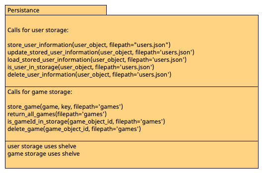
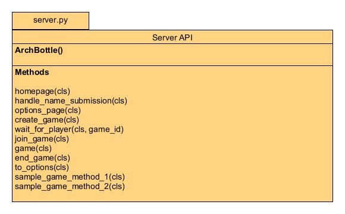
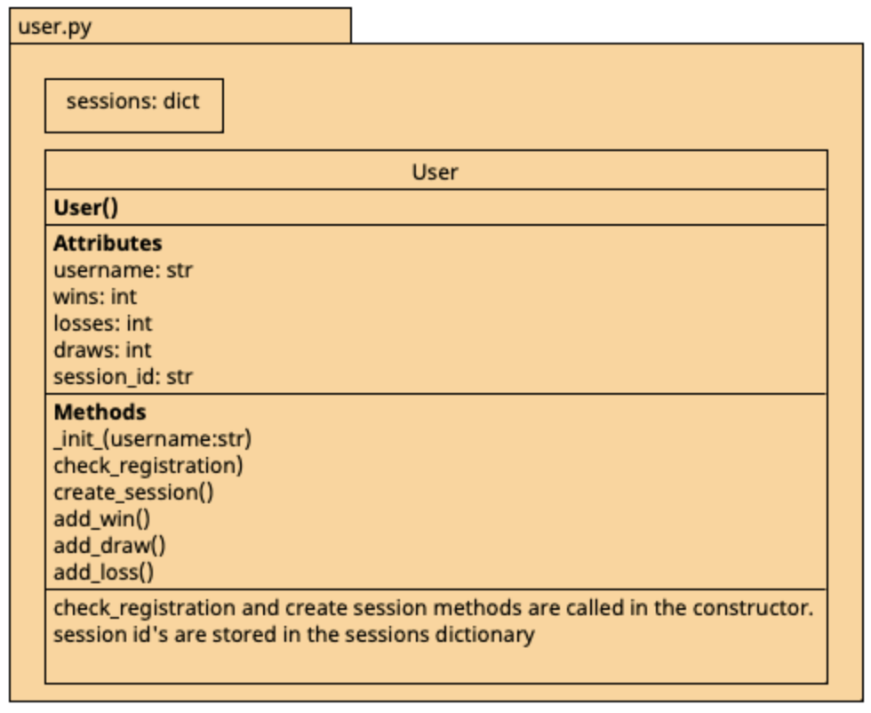
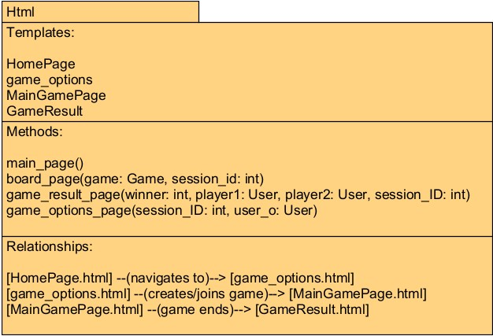

# Refactoring Into Framework
- How could the project code be refactored into a framework to support the creation of ANY turn-based two player game, instead of being designed to support a specific turn-based utimate tic tac toe game?_
- Explain how the module interfaces and responsibilities would change, and how a game programmer could use your framework to make coding their game easier.
- Make use of architectural diagrams to explain your refactored architecture.
- Put your documents for this part of the submission into a repo folder called "docGameFrame"

## Persistence

- #### User Persistence functions:
  - The user persistence functions use the json technology and assumes that the game only wants to store usernames, wins, losses, and draws. To make the change easier we could perhaps switch to using the shelve.py technology. Using this we would be able to store the user objects themselves and get them out of storage alot more easily. We wouldnt be making any assumptions as to what the userobject entails.
  - We would need to be careful in choosing different unique keys for the user storage. As different types of games might allow players to have the same username. 
  - We might opt to use a unique player id instead that would be randomly generated once the player object is created
  - The persistence functions would then be responsible for making sure that the user objects are stored in persistance and easily retreived.
  - A game programmer might use my framework to create a simple way of persisting user history. In this way a layout of the relevant functions would be installed. 
  - The programmer will also be able to make any modifications to file storage locations as this is an option included in the persistance functions.
  - Switching to a shelve technology would decouple the module more, making it more portable.
  - The programmer might also choose to add security into their program which would further request the need for storing objects as their original format instead of switching to them to dictionaries.
  
- #### Game Persistence functions:
  - The game persistence functions would not need to be changed majorly. Perhaps we would need to choose different naming of items.
  - The code now stores a games along with game sessions related to the game in a list form. The programmer might opt to store games in the same manner.
  - A better way would be to store the games themselves. And have games a pointer to them. This removing the way list setup that is implemented into our program.
  - Another thing to note would be that games would then need to store specific players within them.
  - Using a Shelve technology helps greatly as we would not need to know what is inside our object when we store them.

## Game

- The Game class is responsible only for the underlying game logic, and as such does not need any significant changes. 
It is weakly coupled with the rest of the project and could mostly be swapped into a different application and work. The 
only thing that would need to change is the method used for generating game IDs which currently relies on persistence. The public API
for this module doesn't have to change at all in order for it to be used more generally. 

## Server

- #### Routing:
  - The routing could mostly stay the same if server.py was used for a different type or turn-based game. 
    - The homepage, options page, creation of games, joining games are all de-coupled from the actual game logic itself.
    - Different templates would need to be added to the Templator module, and server would just need to pass in whatever the required arguments would be.
    - It would be very easy to add new routing options for different pages if this was required.
    - A lot of the routed pages require sessions IDs to be used already, so if this a requirement for a different game the functionality is already there.

- #### Methods for setting up the game:
  - Most of these are de-coupled from game logic.
    - Homepage, name submissions, options page, creating and joining games functions should all work for different types of games.
  - The make_move function is very interlinked with game logic, however.
    - This function would not work at all with other games, as it specifically uses coordinates from the game board to make moves.
    - It would need to be rewritten into one or more functions that handle moves in the game that is trying to be played.

## User

- The user component is very decoupled from other modules and represents a generic idea of storing user information. The only module it relies on is persistence, any change made to the persistent storing module should require reviewing the user functions and make sure they use the correct storing methods. Refer to the architectural document to have a better understanding of the current method functionalities mentioned below.
  - ### Sessions:
    - This module creates and stores a session id for each user object created. This feature will be useful for any web based application.
    - create_session(): creates a 4 digit number and stores it in sessions dictionary as a string, assigned to its user object. This method currently runs in the constructor and modifies the session_id attribute. Any changes to session id system should be made here.
 
  - ### Registration:
    - check_registration(): This module checks and registers users with this method. It checks the persistent storage and automatically restores the information if this user registered before, improving simplicity. Any change to registering system should be made here.

  - ### Updating information:
    - add_win/loss/draw(): This module has 3 methods that modify attributes. They can be used comfortably for any game with win/loss systems that keep track of user scores. Simply use these methods to manipulate user scores.

# HTML

The HTML Templating Module is designed to abstract the HTML page generation in a turn-based game framework. It allows game developers to create a user interface without worrying about the underlying HTML code.

## Components

- `main_page()`: Renders the homepage.
- `board_page()`: Generates the game board interface.
- `game_result_page()`: Displays the game results.
- `game_options_page()`: Shows the game options for creating or joining a game.

Game developers can use these methods by passing the required parameters, such as game state or user data. The module handles the rendering of HTML content based on the given templates and data.

Templates are located in the "templates" directory and can be modified to fit the theme and rules of the target game. Custom game logic and states must be reflected in the provided templates.

Game objects and user data must be passed to the templating methods to render the game state. It's the developer's responsibility to ensure that the game object adheres to the interface expected by the templator.

## File Structure

- templates/
  - HomePage.html
  - game_options.html
  - MainGamePage.html
  - GameResult.html

The integration of templates with server and game logic is essential, as the game's functionality heavily relies on this synergy. Developers should maintain this tight coupling to ensure a cohesive and interactive gaming experience.

