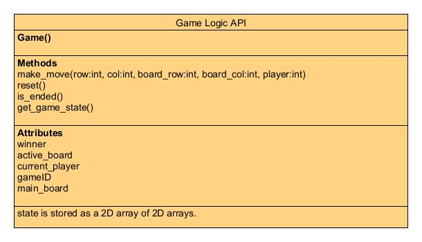

# App Logic Module

__This module is used to create an ultimate tic-tac-toe board and manipulate it, as well as
store information such as the current player (1 or 2) and the victor of the match. It does NOT contain any
information about users, its scope is limited to the actual logic of the game. To use this module, create a new Game
object
and then make moves using the make_move function.__

**class Game**: an instance of this class represents a match of ultimate tic-tac-toe.

| Attribute      | Description                                                                                                                             | 
|----------------|-----------------------------------------------------------------------------------------------------------------------------------------|
| winner         | The winner of the match. 0 if drawn, 1 if player 1 wins, 2 if player 2 wins, None if match is not complete.                             | 
| active_board   | Reference to the currently active sub-board. If this is None, then the player is free to play wherever, such as at the start of a game. | 
| current_player | The current player as an int, 1 or 2. This automatically switches when a move is made.                                                  |
| main_board     | Stores a list of lists of board objects. Rarely needs to be accessed outside of the class.                                              | 
| gameId         | the game ID of this game                                                                                                                | 

| Method                                                                     | Description                                                                                                                                                                                                                                                                                                                                                                                                                                                                                     | 
|----------------------------------------------------------------------------|-------------------------------------------------------------------------------------------------------------------------------------------------------------------------------------------------------------------------------------------------------------------------------------------------------------------------------------------------------------------------------------------------------------------------------------------------------------------------------------------------|
| make_move(row: int, col: int, board_row: int, board_col: int, player: int) | Used to make a move on the board.  row and col are mandatory, and are used to select which square of the sub-board to use.   board_row and board_col are optional, and are used to select which sub-board to use as active. If left blank, the active_board will be used by default. Both must either be provided a value, or be left blank.   player selects which player will be making the move. If left blank, it will default to current_player. It can usually be left blank. | 
| reset()                                                                    | Fully resets the board to blank.                                                                                                                                                                                                                                                                                                                                                                                                                                                                | 
| get_game_state()                                                           | Returns the contents of the game, as a list of lists of lists of lists.                                                                                                                                                                                                                                                                                                                                                                                                                         |
| is_ended()                                                                 | Returns True if the game is over, False otherwise.                                                                                                                                                                                                                                                                                                                                                                                                                                              |

Unit tests for this module can be found in tests/test_game.py. 