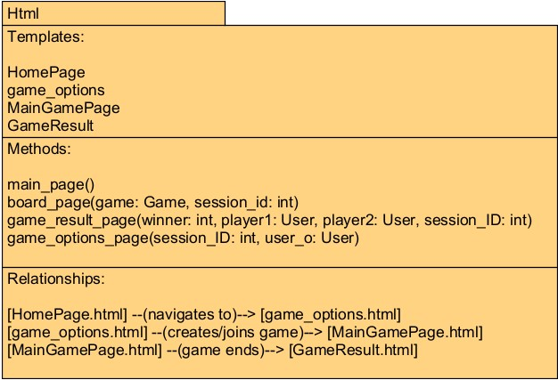

# HTML Templating module

The HTML templating module is responsible for getting HTML templates and populating them with data.

**class Templator**: Consists of static methods, with each method corresponding to one template.

| Method                                                                       | Description                                                                                                                                                                                                                                   | 
|------------------------------------------------------------------------------|-----------------------------------------------------------------------------------------------------------------------------------------------------------------------------------------------------------------------------------------------|
| main_page()                                                                  | Returns the HTML page for the home page of the game (i.e. the login page). This page is always the same.                                                                                                                                      | 
| board_page(game: Game, session_id: int)                                      | game: The game object which is being displayed.   session_id: session id of the player this page is being presented to.  Returns the HTML page of the game board, populated with the data from that game.                             | 
| game_result_page(winner: int, player1: User, player2: User, session_ID: int) | winner: 0, 1 or 2 depending on draw/winner.   player1 and player2: the two players in the game.   session_ID: id of the player seeing this page.   Returns the game result page populated with the winner (or draw) of the match. |
| game_options_page(session_ID: int, user_o: User)                              | session_ID: session ID of the user this page is being presented to.   user_o: User object from which to get stats.   Returns the join game / create game page.                                                                        |

| Templates                  | Description                                                                                                                                                                   | 
|----------------------------|-------------------------------------------------------------------------------------------------------------------------------------------------------------------------------|
| HomePage.html              | This template serves as the welcome page for the Ultimate Tic Tac Toe game. It features a simple user interface prompting the user to enter their name to start the game.     |
| game_options.html          | This template gives a player both the options of either creating a game or joining a game by using game Id                                                                    |                                           
| MainGamePage.html          | This template is the main interface for the Ultimate Tic Tac Toe game. It includes a dynamic game board, notification bar for real-time updates, and game status information. | 
| GameResult.html            | This template shows the result of the game after completion, including win, loss, or draw status. Player can also go back to the options page in this template.               |

