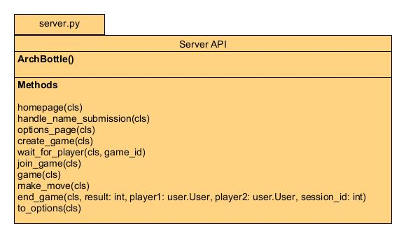

# Server API Module

__The arch_serverAPI module routes requests for the ultimate tic-tac-toe game. It allows users and their sessions to be created
which can then interact with the game. It utilizes methods from game.py and user.py, along with html.py's HTML Templator module
to display the game and allow users to interact with it.__

**class ArchBottle**: an instance of the server that is created when the server is started.

| Method                                                                              | Description                                                                                                                                                                | 
|-------------------------------------------------------------------------------------|----------------------------------------------------------------------------------------------------------------------------------------------------------------------------|
| homepage(cls)                                                                       | Displays the homepage for the server, where the users' names are collected, and their session IDs and user objects are created/loaded.                                     |
| handle_name_submission(cls)                                                         | Collects the user's name to be stored. A session ID is also created here.                                                                                                  | 
| options_page(cls)                                                                   | Displays options for the user to pick after they login, which are create game and join game. It also shows the user's history.                                             |
| create_game(cls)                                                                    | Creates the game board to be played on.                                                                                                                                    |
| wait_for_player(cls, game_id)                                                       | Displays a page that refreshes every second to the first player after they create a game, while they wait for a second player to join.                                     |
| join_game(cls)                                                                      | Allows a user to join a game that has been created by another user.                                                                                                        |
| game(cls)                                                                           | Displays the game to the players.                                                                                                                                          |
| make_move(cls)                                                                      | Processes the player's move by using the game logic's make_move method.   It requests the coordinates of the tile that was clicked from the HTML template of the game. |
| end_game(cls, result: int, player1: user.User, player2: user.User, session_id: int) | Ends the game once a player wins.                                                                                                                                          |
| to_options(cls)                                                                     | Routes the page back to the options page.                                                                                                                                  |

