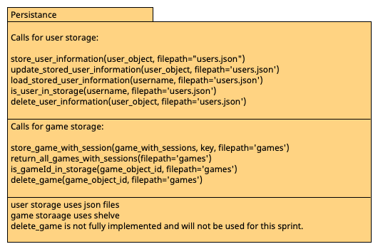

# Store Module

__This module is used to persist data about Users and game objects.__ 
- User data is stored using JSON in users.json. Game data is stored using shelves with the name games(db, bak, etc...).
Users are stored in a list of users in the json file. Function descriptions included in this module are below.
The functions assume user_object.username is an attribute that is unique to every player and not case-sensitive.
- Game data is stored in the form [game, userObject, userObject]. The functions below assume all games have a unique gameId. Descriptions included in this module are below. We decided on not implementing game deletion for this sprint as it would require more time. 

#### User persistence Functions:

| Function                                                          | Description                                                                                                                                                                                                                                                                                                              |
|-------------------------------------------------------------------|--------------------------------------------------------------------------------------------------------------------------------------------------------------------------------------------------------------------------------------------------------------------------------------------------------------------------|
| store_user_information(user_object, filepath="users.json")        | This function is used to store a user in the users.json file using the user_object parameter. Filepath parameter is only used to make correct unittest that do not interfere with the actual user's storage.                                                                                                             |
| update_stored_user_information(user_object,filepath="users.json") | This function is used to update stored user information in users.json. It looks for the item in storage using the username attribute and updates each attribute the object has. Filepath parameter is only used to make correct unittest that do not interfere with the actual game's storage.                           |
| load_stored_user_information(username, filepath="users.json")     | This function is used to provide Users.py a list with all the associated players history. The function returns a list of 0s if the player is not found in storage or the actual players history if found. Filepath parameter is only used to make correct unittest that do not interfere with the actual game's storage. |
| is_user_in_storage(username,filepath="users.json")                | This function is used to check whether a user is in storage or not and returns True or False respectively. Filepath parameter is only used to make correct unittest that do not interfere with the actual game's storage.                                                                                                |
| delete_user_information(user_object, filepath="users.json")       | This function is used to delete user information from storage. Filepath parameter is only used to make correct unittest that do not interfere with the actual game's storage.                                                                                                                                            |

#### Game persistence Functions:
| Function                                                           | Description                                                                                                                                                           |
|--------------------------------------------------------------------|-----------------------------------------------------------------------------------------------------------------------------------------------------------------------|
| store_game_with_session(game_with_sessions, key, filepath='games') | This function stores the game lists in persistance, Filepath parameter is only used to make correct unittest that do not interfere with the actual user's storage.    | 
| return_all_games_with_sessions(filepath='games')                   | This function returns all game lists from persistance, Filepath parameter is only used to make correct unittest that do not interfere with the actual user's storage. |
| is_gameId_in_storage(game_object_id, filepath='games')              | This function returns true/false if a game_id is in storage, Filepath parameter is only used to make correct unittest that do not interfere with the actual user's storage.|

Unit tests for this module can be found in tests/store_test.py. There are 2 unittests in store_test.py that will not be implemented. This is an issue we have addressed in the issue tracker. There are no unitests for game deletion beaucse it is not implemented.