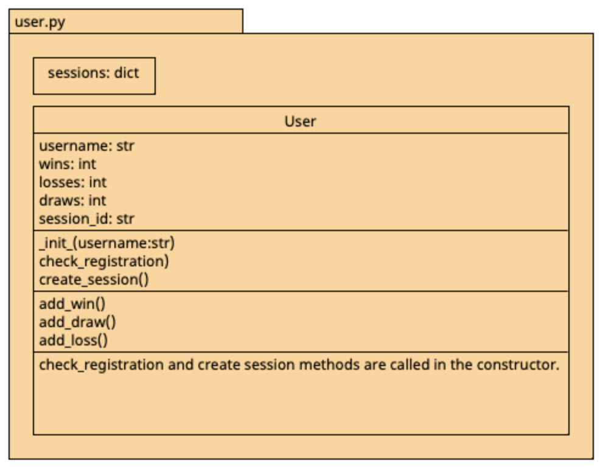

# User Module
__Detailed documentation and component diagram of the User info module will be provided here.__ 

__This module is used to create and keep track of the user information for the players, and manage their current sessions. 
It does NOT contain any information about the game. This module imports functions from persistance.py to store and load 
user information in persistent storage. To use this module, create a new User object and give a username (str) as a parameter,
and the constructor will automatically check if this username exists in the persistent storage, load their information it does,
and create a new user with default information if it doesn't exist. A session id will also be assigned to this user object.
 .__

**class User**: an instance of this class represents a user playing the game.

**dict sessions** keeps track of the user objects and their session id's.

| Attribute  | Description                                                                         | 
|------------|-------------------------------------------------------------------------------------|
| username   | username entered by the user                                                        | 
| wins       | amount of times the player won, can be incremented with add_win() method            | 
| losses     | amount of times the player lost, can be incremented with add_loss() method          |
| draws      | amount of times the player was in a draw, can be incremented with add_draw() method |
| session_id | a session id assigned to the user object upon creation                              |

| Method               | Description                                                                                               | 
|----------------------|-----------------------------------------------------------------------------------------------------------|
| check_registration() | checks if this user was created and stored before, retrieves and returns their information if it was      | 
| create_session()     | generates a random unique session ID for the user and stores in the sessions dict, returns the session id | 
| add_win()            | increments the wins attribute by 1, and updates the user's information stored in persistent storage       |
| add_draw()           | increments the draws attribute by 1, and updates the user's information stored in persistent storage      |
| add_loss()           | increments the losses attribute by 1, and updates the user's information stored in persistent storage     |

**Incomplete features/ things to improve**:
- We don't have any kind of security system at the moment. The user information can simply be retrieved by entering the username,
meaning anyone can access other user's information. A password system can be introduced to prevent this in the next print. I will be adding 
that to the backlog.
- The game crashes if both the players have the username, thinking they are the same user. This improvement won't be made in this sprint but 
an error prevention would need to be done in the future of this project.
- The usernames are not case-sensitive at the moment. 

The UML diagram for this module can be found below.

